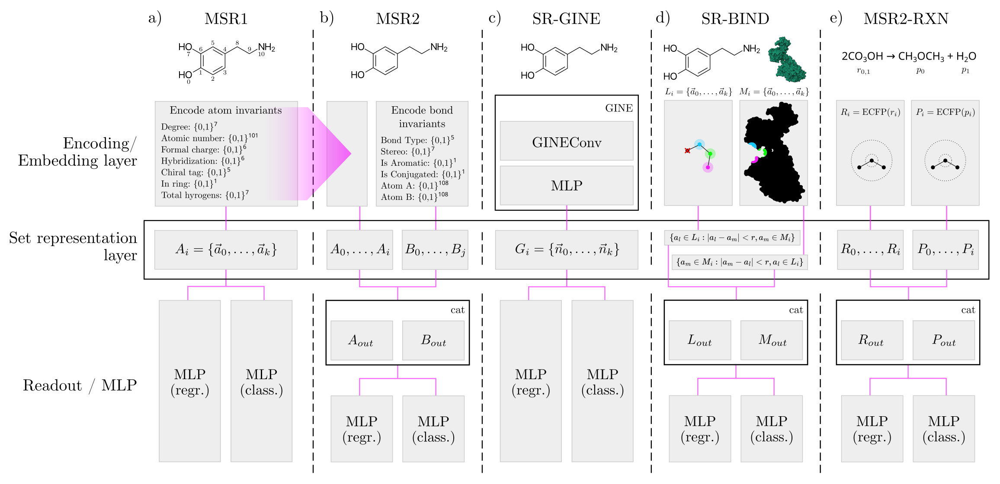

# MolSetRep

MolSetRep is a Python library that provides encoders and machine learning models for molecular set representation learning. The following models that are ready to be used with [Pytorch Lightning](https://lightning.ai/docs/pytorch/stable/) are included.

<br />

<div align="center">

**[INSTALLATION](https://github.com/daenuprobst/molsetrep#installation) •
[MODELS](https://github.com/daenuprobst/molsetrep#models) •
[EXAMPLES](https://github.com/daenuprobst/molsetrep#examples) •
[CITE](https://github.com/daenuprobst/molsetrep#cite)**

</div>

<br />



Overview of set-based and -enhanced models. All implemented models consist of three parts: An encoding or embedding layer, a set representation layer and, finally, a readout / MLP layer. (**a**) The simplest molecular set representation model MSR1 takes molecules as input and encodes each atom as 133-dimensional binary vectors $\vec{a}_i$} into molecular sets $A_i$. These sets with differing cardinalities are passed into a RepSet set representation layer and read out by a regression or classification MLP. (**b**) The dual molecular set representation model MSR2 encodes the atoms and bonds of molecules into two distinct sets $A_i$ and $B_i$ and passes them to two separate RepSet layers whose outputs $A_{out}$ and $B_{out}$ are concatenated followed by either a regression or classification MLP. (**c**) SR-GINE is a GIN model with a GINEConv layer enhanced with a set representation layer replacing global pooling. The node embeddings $\vec{n}_i$ are then passed to a RepSet layer as graph sets $G_i$ followed by an MLP regressor or classifier. (**d**) SR-BIND follows the dual-set architecture of MSR2 by employing two parallel RepSet layers. Atoms $a_l$ of the ligand $L_i$ are added to a set if they are within radius $r$ of any protein atom $a_m$. Conversely, atoms $a_m$ from protein $M_i$ are added to a second set only if they are within radius $r$ of any ligand atom $a_l$. Both sets are passed to separate RepSet layers whose output is concatenated and passed to a regression or classification MLP. (**e**) MSR2-RXN also follows the dual-set architecture of MSR2 by employing two parallel RepSet layers. Reactants $r_i$ and products $p_i$ are encoded using ECFP with a radius of 3 and size of 2,048 into molecular sets $R_i$ and $P_i$. Both sets are passed to separate RepSet layers whose output is concatenated and passed to a regression or classification MLP.

## Installation

```bash
pip install molsetrep
```

## Models

The following models / architectures and associated encoders are available. If you prefer to not use lightning, you can also use the torch modules directly.

### Molecular property prediction

#### Set-based (MSR1 and MSR2)

- `LightningSRClassifier`
  - Wraps `SRClassifier`
  - Takes molecules encoded by `SingleSetEncoder` as input
- `LightningSRRegressor`
  - Wraps `SRRegressor`
  - Takes molecules encoded by `SingleSetEncoder` as input

- `LightningDualSRClassifier`
  - Wraps `DualSRClassifier`
  - Takes molecules encoded by `DualSetEncoder` as input
- `LightningDualSRRegressor`
  - Wraps `DualSRRegressor`
  - Takes molecules encoded by `DualSetEncoder` as input

#### Set-enhanced graph neural network (SR-GINE)

- `LightningSRGNNClassifier`
  - Wraps `SRGNNClassifier`
  - Takes molecules encoded by `GraphEncoder` as input
- `LightningSRGNNRegressor`
  - Wraps `SRGNNRegressor`
  - Takes molecules encoded by `GraphEncoder` as input

### Protein-ligand binding affinity (or other property) prediction

- `LightningSRGNNClassifier`
  - Wraps `SRGNNClassifier`
  - Takes molecules encoded by `GraphEncoder` as input
- `LightningSRGNNRegressor`
  - Wraps `SRGNNRegressor`
  - Takes molecules encoded by `GraphEncoder` as input

### Reaction yield (or other property) prediction

- `LightningDualSRClassifier`
  - Wraps `DualSRClassifier`
  - Takes molecules encoded by `RXNSetEncoder` as input
- `LightningDualSRRegressor`
  - Wraps `DualSRRegressor`
  - Takes molecules encoded by `RXNSetEncoder` as input

## Examples

### Molecular property prediction (ADME)

An example of molecular set representation learning for molecular property prediction using single sets, dual sets, and set-enhanced GNNs can be found in the notebook [example/property_prediction.ipynb](example/property_prediction.ipynb).

### Protein-ligand binding affinity prediction

For this example, make sure you have downloaded the PDBbind database (or any other data set you may want to use) and prepare it using the script [scripts/preprocess_pdbbind.py](scripts/preprocess_pdbbind.py).

An example of molecular set representation learning for protein-ligand binding affinity prediction using dual sets can be found in the notebook [example/property_prediction.ipynb](example/preprocess_pdbbind.ipynb).

### Reaction yield prediction

An example of molecular set representation learning for reaction yield prediction using dual sets can be found in the notebook [example/property_prediction.ipynb](example/reaction_yield_prediction.ipynb).

## Cite

...
